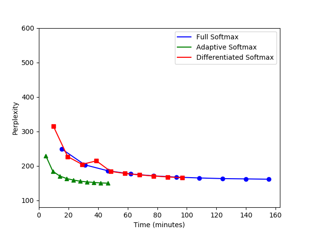

# Adaptive Softmax for Keras

Keras implementations (requiring TensorFlow backend) of Adaptive Softmax[1](#efficient-softmax-approximation-for-gpus) and a variation of Differentiated Softmax[1](#efficient-softmax-approximation-for-gpus),[2](#strategies-for-training-large-vocabulary-neural-language-models). These variations of softmax exploit differences in word frequencies to substantially reduce neural language model training time.

## Performance Comparison

The above compares perplexity over time for full, adaptive, and differentiated softmax on the [text8](http://mattmahoney.net/dc/textdata.html) dataset over 10 training iterations. Each point represents a completed epoch. Note that adaptive softmax takes less than half the training time of full softmax to achieve the same perplexity score. See [examples/text8_benchmark.py](examples/text8_benchmark.py) for further details).

## References

1.  Edouard Grave, Armand Joulin, Moustapha Cissé, David Grangier, Hervé Jégou, _[Efficient softmax approximation for GPUs](https://arxiv.org/abs/1609.04309)_

2.  Welin Chen, David Grangier, Michael Auli, _[Strategies for Training Large Vocabulary Neural Language Models](https://arxiv.org/abs/1512.04906)_
